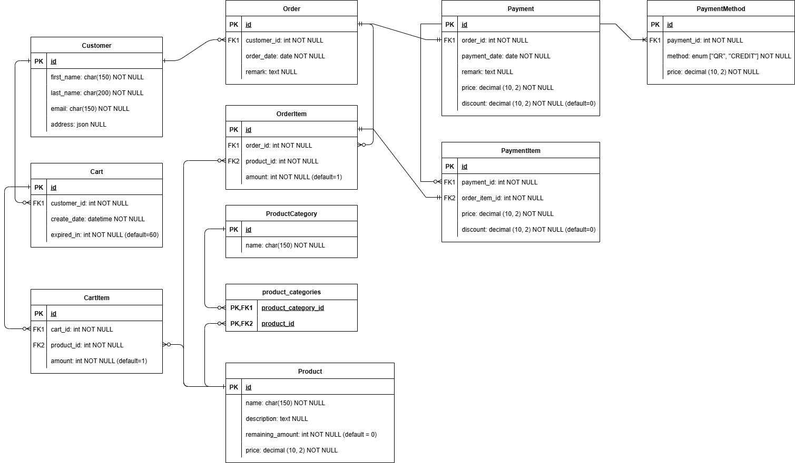

# WEEK 3 Exercises - Django Model (3 คะแนน)

## Creating Models

1. สร้าง project ใหม่ชื่อ "myshop" (สร้าง vitual environment ใหม่ด้วย)
2. สร้าง app ชื่อ shop และทำการตั้งค่าใน `settings.py`
3. แก้ไขไฟล์ `models.py` สร้าง models ตาม ERD นี้

4. ทำการ makemigrations
5. ทำการ migrate เพื่อสร้างตาราง

### การให้คะแนน

- สร้าง models ที่มีความสัมพันธ์แบบ one-to-many ได้ครบถ้วนถูกต้อง (0.3 คะแนน)
- สร้าง models ที่มีความสัมพันธ์แบบ one-to-one ได้ครบถ้วนถูกต้อง (0.2 คะแนน)
- สร้าง models ที่มีความสัมพันธ์แบบ many-to-many ได้ครบถ้วนถูกต้อง (0.5 คะแนน)
- กำหนด ENUM method ใน model PaymentMethod ได้ถูกต้อง (0.5 คะแนน)

## Making Queries - ให้ทำใน shell

1. สร้าง record ข้อมูลในตาราง Customer โดยมีข้อมูลดังนี้ (0.2 คะแนน)

    - ชื่อจริง: Django 
    - นามสกุล: Reinhardt 
    - อีเมล: dj_rein@mail.com 
    - ที่อยู่: Liberchies, Pont-à-Celles, Belgium

2. อัพเดทข้อมูลของ Customer ที่ชื่อ Django ดังนี้ (0.2 คะแนน)

    - ชื่อจริง: Darwin
    - นามสกุล: Nunez
    - อีเมล: 660xxxxx@kmitl.ac.th

3. สร้าง record ข้อมูลของ Product และให้แสดงสินค้าที่มีราคามากกว่า 500 โดยมีข้อมูลดังนี้ (0.2 คะแนน)

    **สินค้าชิ้นที่ 1**
    - ชื่อ USB-C Charger
    - คำอธิบาย 20W fast charging USB-C adapter, compact and efficient.
    - จำนวนคงเหลือ 100 
    - ราคา 299.50 
    
    **สินค้าชิ้นที่ 2**
    - ชื่อ Noise Cancelling Earbuds
    - คำอธิบาย Wireless earbuds with advanced noise cancelling technology.
    - จำนวนคงเหลือ 50
    - ราคา 1890.00
    
    **สินค้าชิ้นที่ 3**
    - ชื่อ Mechanical Keyboard
    - คำอธิบาย RGB mechanical keyboard designed for gamers with tactile feedback.
    - จำนวนคงเหลือ 25
    - ราคา 2499.99

4. สร้างข้อมูล Order ที่เป็นของ Customer ที่ชื่อ Darwin Nunez โดยจะมีข้อมูลดังนี้ (0.2 คะแนน)

    - order_date: 16 กรกฎาคม 2568
    - ramark: This is order for Darwin Nunez

    จากนั้นสร้าง OrderItem 2 รายการ ได้แก่ สินค้า Mechanical Keyboard โดยมี amount = 1 และ USB-C Charger โดยมี amount = 2

5. ทำการ SELECT ข้อมูลสินค้าที่มี string "cha" อยู่ในชื่อสินค้า (ไม่สนใจตัวใหญ่ตัวเล็ก) (0.2 คะแนน)

## Datetime & Timezone - ให้ทำใน shell

1. แปลง `datetime.now()` เป็น time zone "Asia/Bangkok" (0.2 คะแนน)
2. จงหาว่านับจากวันนี้ไปอีก 500 วันเป็นวันที่เท่าไหร่ และ เป็นวันอะไรในสัปดาห์ (0.3 คะแนน) (**Hint:** [weekday](https://docs.python.org/3/library/datetime.html#datetime.date.weekday))
